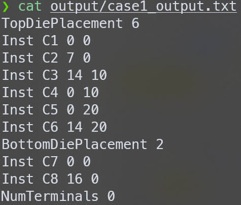
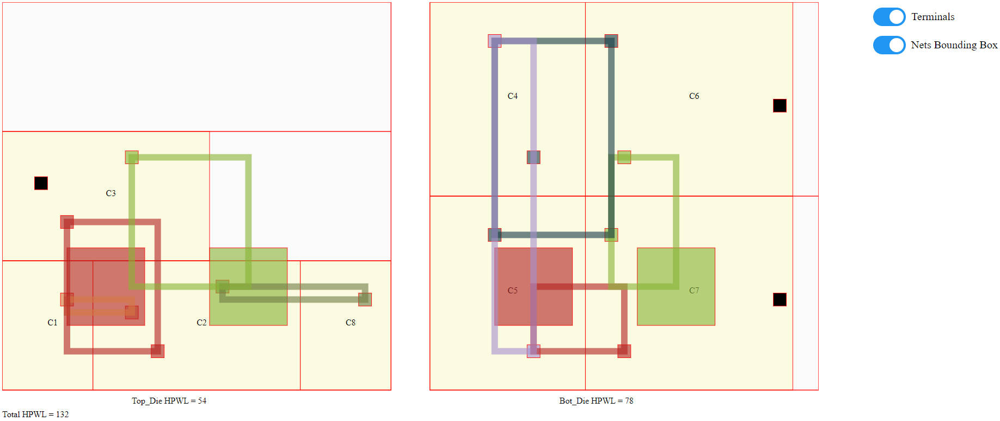

# 3d-placer  
iccad contest 2022 problem B  
  
## Problem  

  
   

## Evaluation  
• Max placement utilization constraint must be satisfied  
• All the given instances must be placed on either top die or bottom die  
• All the instances must be on row without overlap  
• Hybrid bonding terminal spacing constraint must be satisfied  
• Crossing-die nets must have 1 and only 1 hybrid bonding terminal  
• The minimum resolution of all the coordinate values is integer  
• Runtime limit is 1hr for each case in the evaluation machine. The hidden cases will be in the same scale as public cases.  
  
If the program and the output data violate any of these above bullets, you will get 0 score for the corresponding test case.  
  
**Evaluation score = HPWL of top die + HPWL of bottom die**  
  
## Compile  
type 'make'  
## Execution  
type 'bin/3d-placer <input.txt> <output.txt>'  

## Example
**Compile & Execute:**  
make  
bin/3d-placer testcase/case1.txt output/case1_output.txt  
**Result:**  

  
   

